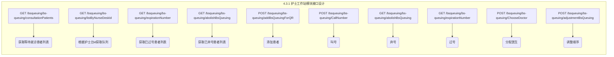

```mermaid
graph LR
    subgraph "4.3.1 护士工作站模块接口设计"
    A["GET /bsqueuing/bs-queuing/consultationPatients"] --> B(获取等待就诊患者列表)
    C["GET /bsqueuing/bs-queuing/listByNurseDeskId"] --> D(根据护士台id获取队列)
    E["GET /bsqueuing/bs-queuing/expirationNumber"] --> F(获取已过号患者列表)
    G["GET /bsqueuing/bs-queuing/abolishBsQueuing"] --> H(获取已弃号患者列表)
    I["POST /bsqueuing/bs-queuing/addBsQueuingForQR"] --> J(添加患者)
    K["POST /bsqueuing/bs-queuing/CallNumber"] --> L(叫号)
    M["GET /bsqueuing/bs-queuing/abolishBsQueuing"] --> N(弃号)
    O["GET /bsqueuing/bs-queuing/expirationNumber"] --> P(过号)
    Q["POST /bsqueuing/bs-queuing/ChooseDoctor"] --> R(分配医生)
    S["POST /bsqueuing/bs-queuing/adjustmentBsQueuing"] --> T(调整顺序)
    end

```