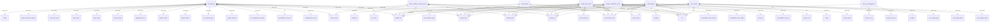

```mermaid
erDiagram
    bs_queuing ||--|{ id :INT  
    bs_queuing ||--|{ config_queue_code :VARCHAR
    bs_queuing ||--|{ consultation_room_id :INT
    bs_queuing ||--|{ his_registration_number :VARCHAR
    bs_queuing ||--|{ patient_number :VARCHAR
    bs_queuing ||--|{ bs_queuing_type :VARCHAR
    bs_queuing ||--|{ queue_status :VARCHAR
    bs_queuing ||--|{ patient_name :VARCHAR
    bs_queuing ||--|{ registration_time :DATETIME
    bs_queuing ||--|{ doctor_code :VARCHAR
    bs_queuing ||--|{ doctor_name :VARCHAR
    bs_queuing ||--|{ dept_code :VARCHAR
    bs_queuing ||--|{ dept_name :VARCHAR
    bs_queuing ||--|{ scan_code_time :DATETIME
    bs_queuing ||--|{ create_time :DATETIME
    bs_queuing ||--|{ create_by :VARCHAR
    bs_queuing ||--|{ update_time :DATETIME
    bs_queuing ||--|{ update_by :VARCHAR
    bs_queuing ||--|{ patient_number_original :VARCHAR
    bs_queuing ||--|{ mzlsh :VARCHAR


    call_queuing ||--|{ nurse_desk_code :VARCHAR
    call_queuing ||--|{ id :INT
    call_queuing ||--|{ sentence :VARCHAR
    call_queuing ||--|{ create_time :DATETIME


    config_consultation_room ||--|{ id :INT
    config_consultation_room ||--|{ nurse_desk_code :VARCHAR
    config_consultation_room ||--|{ consultation_room_ip :VARCHAR
    config_consultation_room ||--|{ show_ip :VARCHAR
    config_consultation_room ||--|{ consultation_room_code :VARCHAR
    config_consultation_room ||--|{ consultation_room_name :VARCHAR
    config_consultation_room ||--|{ location :VARCHAR
    config_consultation_room ||--|{ create_time :DATETIME
    config_consultation_room ||--|{ create_by :VARCHAR
    config_consultation_room ||--|{ update_time :DATETIME
    config_consultation_room ||--|{ update_by :VARCHAR


    config_nurse_desk ||--|{ id :INT
    config_nurse_desk ||--|{ nurse_desk_ip :VARCHAR
    config_nurse_desk ||--|{ nurse_desk_code :VARCHAR
    config_nurse_desk ||--|{ nurse_desk_name :VARCHAR
    config_nurse_desk ||--|{ create_time :DATETIME
    config_nurse_desk ||--|{ create_by :VARCHAR
    config_nurse_desk ||--|{ update_time :DATETIME
    config_nurse_desk ||--|{ update_by :VARCHAR


    config_queue ||--|{ id :INT
    config_queue ||--|{ nurse_desk_code :VARCHAR
    config_queue ||--|{ queue_code :VARCHAR
    config_queue ||--|{ queue_name :VARCHAR
    config_queue ||--|{ expert :VARCHAR
    config_queue ||--|{ queue_sort :INT
    config_queue ||--|{ create_time :DATETIME
    config_queue ||--|{ create_by :VARCHAR
    config_queue ||--|{ update_time :DATETIME
    config_queue ||--|{ update_by :VARCHAR


    doctor_relation_config_queue ||--|{ id :INT
    doctor_relation_config_queue ||--|{ doctor_code :VARCHAR
    doctor_relation_config_queue ||--|{ queue_code :VARCHAR
    doctor_relation_config_queue ||--|{ create_time :DATETIME
    doctor_relation_config_queue ||--|{ update_time :DATETIME
    doctor_relation_config_queue ||--|{ create_by :VARCHAR
    doctor_relation_config_queue ||--|{ update_by :VARCHAR
    doctor_relation_config_queue ||--|{ sort_num :INT

    room_ip_management ||--|{ id :INT
    room_ip_management ||--|{ dept_screen_ip :VARCHAR
    room_ip_management ||--|{ doctor_pc_ip :VARCHAR


    sys_setting ||--|{ id :INT
    sys_setting ||--|{ sys_setting_name :VARCHAR
    sys_setting ||--|{ sys_setting_value :VARCHAR
    sys_setting ||--|{ sys_setting_type :VARCHAR
    sys_setting ||--|{ module :VARCHAR
    sys_setting ||--|{ create_time :DATETIME
    sys_setting ||--|{ create_by :VARCHAR
    sys_setting ||--|{ update_time :DATETIME
    sys_setting ||--|{ update_by :VARCHAR

```