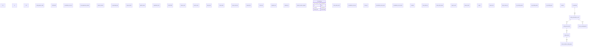

```mermaid
erDiagram
        PK id INT
        config_queue_code VARCHAR
        consultation_room_id INT
        his_registration_number VARCHAR
        patient_number VARCHAR
        bs_queuing_type VARCHAR
        queue_status VARCHAR
        patient_name VARCHAR
        registration_time DATETIME
        doctor_code VARCHAR
        doctor_name VARCHAR
        dept_code VARCHAR
        dept_name VARCHAR
        scan_code_time DATETIME
        create_time DATETIME
        create_by VARCHAR
        update_time DATETIME
        update_by VARCHAR
        patient_number_original VARCHAR
    call_queuing {
        nurse_desk_code VARCHAR
        id INT
        sentence VARCHAR
        create_time DATETIME
    }
        PK id INT
        nurse_desk_code VARCHAR
        consultation_room_ip VARCHAR
        show_ip VARCHAR
        consultation_room_code VARCHAR
        consultation_room_name VARCHAR
        location VARCHAR
        create_time DATETIME
        create_by VARCHAR
        update_time DATETIME
        PK id INT
        nurse_desk_ip VARCHAR
        nurse_desk_code VARCHAR
        nurse_desk_name VARCHAR
        create_time DATETIME
        create_by VARCHAR
        update_time DATETIME
        PK id INT
        nurse_desk_code VARCHAR
        queue_code VARCHAR
        queue_name VARCHAR
        expert VARCHAR
        queue_sort INT
        create_time DATETIME
        create_by VARCHAR
        update_time DATETIME
        PK id INT
        doctor_code VARCHAR
        queue_code VARCHAR
        create_time DATETIME
        update_time DATETIME
        create_by VARCHAR
        update_by VARCHAR
        PK id INT
        dept_screen_ip VARCHAR
        PK id INT
        sys_setting_name VARCHAR
        sys_setting_value VARCHAR
        sys_setting_type VARCHAR
        module VARCHAR
        create_time DATETIME
        create_by VARCHAR
        update_time DATETIME

    bs_queuing ||--o{ config_consultation_room : "关联"
    config_consultation_room ||--o{ config_nurse_desk : "关联"
    config_nurse_desk ||--o{ config_queue : "关联"
    config_queue ||--o{ doctor_relation_config_queue : "关联"
    config_consultation_room ||--o{ room_ip_management : "关联"
```